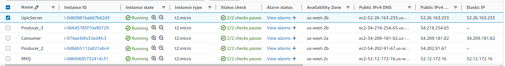
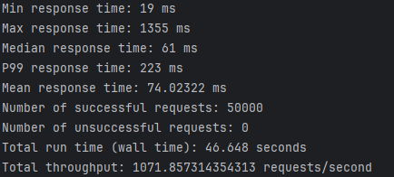
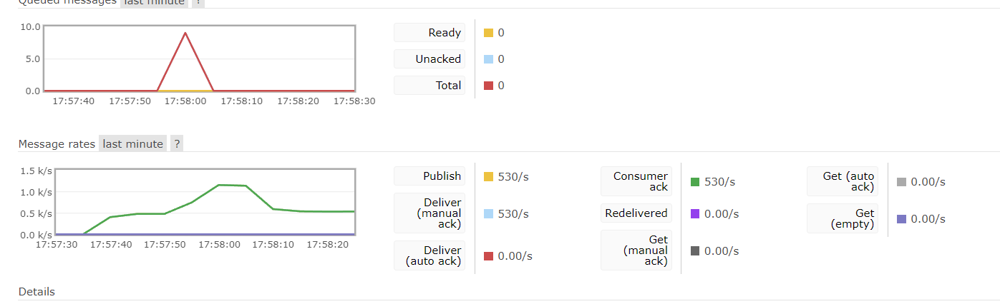
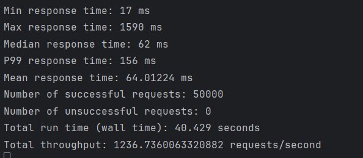
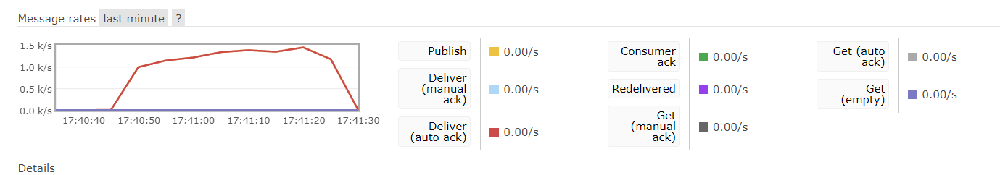

## To locate run file:

- For server: server_spring/target/swagger-spring-1.0.0.jar.
- For consumer: consumer/target/consumer-1.0-SNAPSHOT.jar.
- For client: `mvn clean install` and then `java -jar target/swagger-java-client-1.0.0.jar`.

## Configurations

- For each component, you may check and change configuration like IP or load balancer usage in application.properties file.
- It's path looks like /src/main/resources/application.properties

## Code design

### Server

- Main idea: Rather than each thread creating and closing its own connection to RabbitMQ, build connection pool allowing threads to borrow and reuse channels from a pool, avoding some overhead.

- `ChannelPool`: use BlockingQueue to implement a channel pool. Declare exchange for routing messages, declare and bind server queue.

- `SkiersApiController.writeNewLiftRide` : valid URL as well as send message to RabbitMQ using the `basicPublish`

### Consumer

- Main idea: Also adopt a fixed-size thread pool using ExecutorService. Uses ConcurrentHashMap to ensure thread safety and process messages related to the same skier simultaneously.

- `LiftRideConsumer`: use `basicNack` to manully acknowledge messages received from RabbitMQ to deal with the case where some messages might fail processing temporarily.

- Replicate some data structures from server like Liftride, LiftRideRequest and ChannelPool

###

## Deployment

- I have three server instances and one consumer instance and one for RabbitMQ, shown in the image.

## Results:

### Single instance

### Three instances with Load Balancer

- Note: queue size is 0
  
